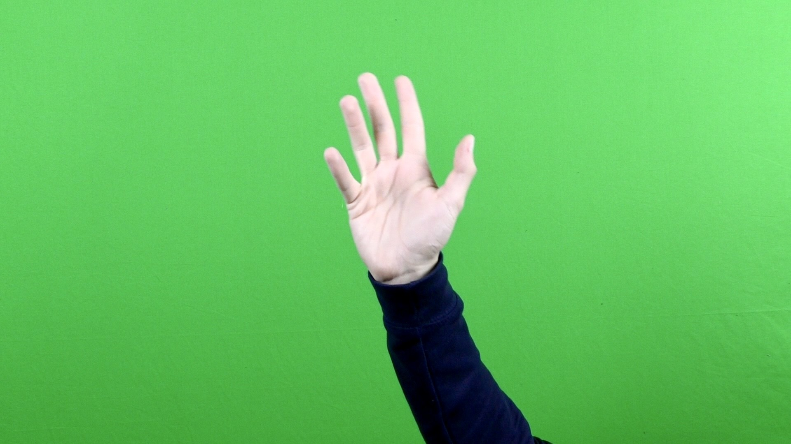
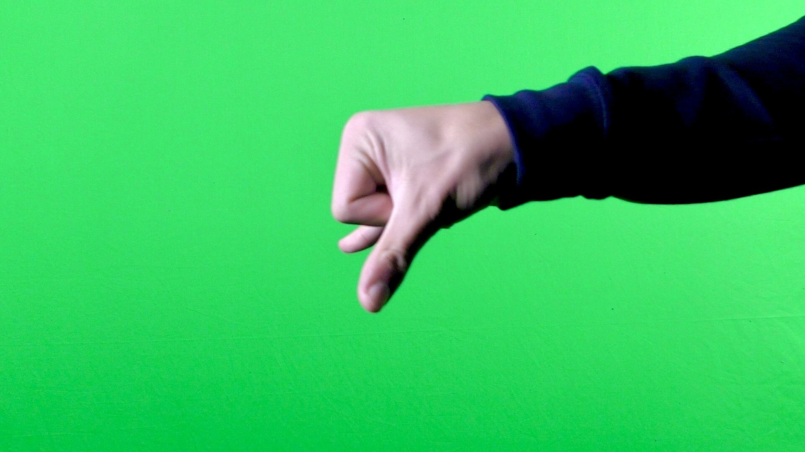
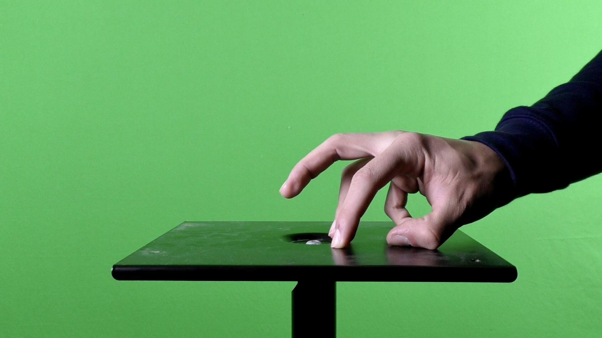

# UKUPHILA – experimental project (2021)

## About project:

We received a task from our teacher that required us to create a video using only our hands, and it should be about Life Creation. I realized that a fast and effective option would be to create a hand performance using a green screen. This way, I generated additional characters, took advantage of the green screen, and transformed everything with an engaging black silhouette style.

## Inspiration:

My inspiration came from our philosophy teacher, who spoke in interesting ways about cultures, nomads, etc. I decided to combine her lessons with my beliefs.

# [UKUPHILA short animation](https://filmfreeway.com/ukuphila)
If you would like to view this animation, please don't hesitate to [click here](https://filmfreeway.com/ukuphila).

-------------------------------------------------------------

# BACK TO THE...
## [Main Page (English for designers)](https://github.com/BenjaminHaverla/English-for-designers.git)
## [Benjamín Haverla – Who am I ?](https://github.com/BenjaminHaverla/First-impression.git)
# Contact me:
## **Mail**: haverla.tros@gmail.com

-------------------------------------------------------------

#### [<– BACK](https://github.com/BenjaminHaverla/First-impression.git)
